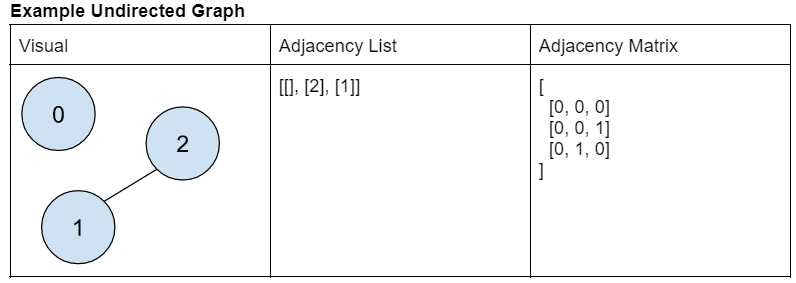
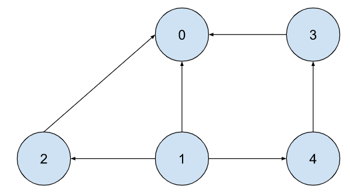

# Algorithmns-Class_HW4

Homework 4 of Algorithmns Class

Write your Java code(submit a .java file) to implement the DFS for graph traversal using the adjacency matrix (either recursive or iterative).

For the test case, you can directly use the above example.  And you should call the DFS function several times with different starting points to show the different traversal orders.

```
DFS(graph,  0);   // one possible output likes   0 
DFS(graph,  1);  //  one possible output likes   1  0  2 4 3
DFS(graph,  2);  // …
DFS(graph,  3);  // …
DFS(graph,  4);  // …
```

Example Graph:



Question 3 Graph:


